

  

  

---

## 👤 About Me

- 🔭 I’m currently working on:new business project
- 🌱 I’m currently learning:TypeScript, React, Figma
- 📫 How to reach me: [Discord](https://discord.com/users/544655741626351616), [LINE](https://line.me/ti/p/KaTvFcbhCR)
- 😄 Pronouns: He/him/his

## 🛠 Skills

### Programming Languages

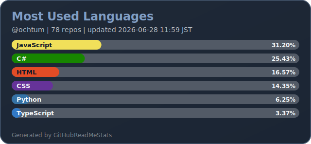

### Framework and Library

### DevTools

### Platform

## 📈 GitHub Stats

<table>
  <tr>
    <td width="50%" valign="top">
      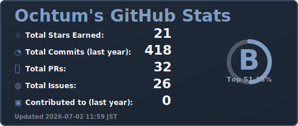
    </td>
    <td width="50%" valign="top">
      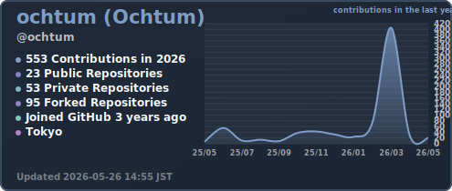
    </td>
  </tr>
  <tr>
  　<td width="100%" valign="top">
      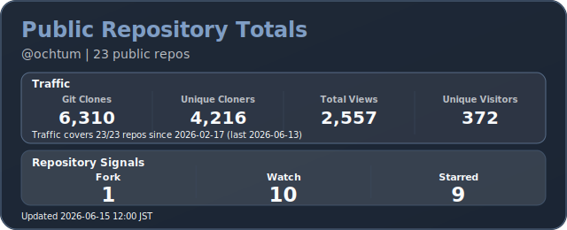
    </td>
  </tr>
</table>

## ✨ My Projects

<table>
  <tr>
    <td width="50%" valign="top">
      <a href="https://github.com/ochtum/CaptureScreenMCP">
        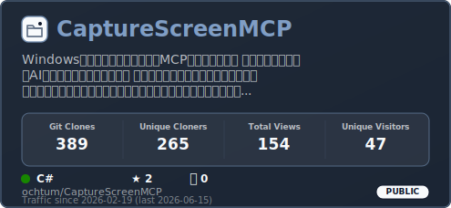
      </a>
    </td>
    <td width="50%" valign="top">
      <a href="https://github.com/ochtum/SlackEmojiBookmaker">
        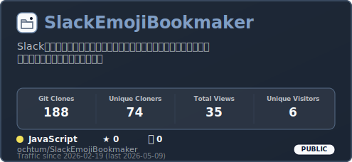
      </a>
    </td>
  </tr>
  <tr>
    <td width="50%" valign="top">
      <a href="https://github.com/ochtum/ClaudeSessionsViewer">
        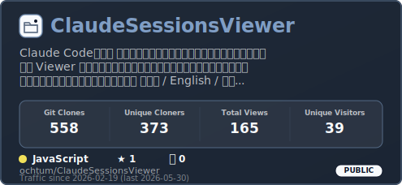
      </a>
    </td>
    <td width="50%" valign="top">
      <a href="https://github.com/ochtum/CodexSessionsViewer">
        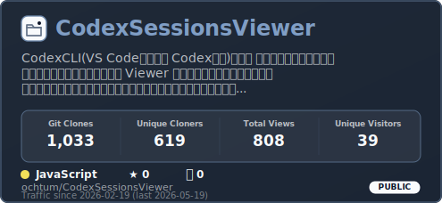
      </a>
    </td>
  </tr>
  <tr>
    <td width="50%" valign="top">
      <a href="https://github.com/ochtum/GitHubCopilotSessionsViewer">
        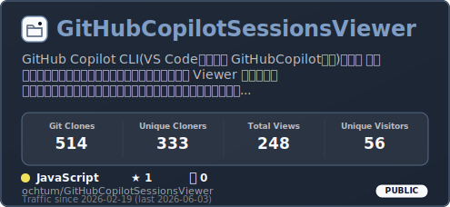
      </a>
    </td>
    <td width="50%" valign="top">
      <a href="https://github.com/ochtum/BandleManager">
        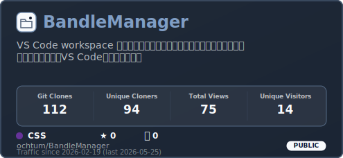
      </a>
    </td>
  </tr>
  <tr>
    <td width="50%" valign="top">
      <a href="https://github.com/ochtum/TechBlogWriter">
        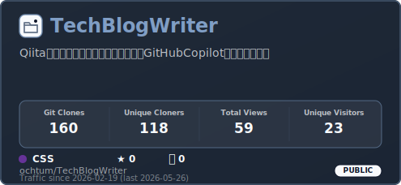
      </a>
    </td>
    <td width="50%" valign="top">
      <a href="https://github.com/ochtum/blazor-gantt-chart">
        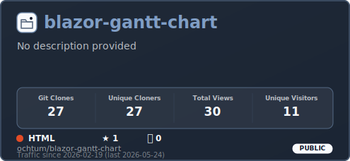
      </a>
    </td>
  </tr>
  <tr>
    <td width="50%" valign="top">
      <a href="https://github.com/ochtum/BlazorWebAsemblyTest">
        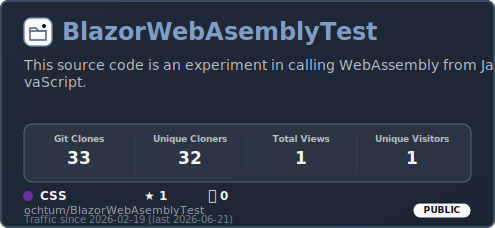
      </a>
    </td>
    <td width="50%" valign="top">
      <a href="https://github.com/ochtum/CSharpKnowledge">
        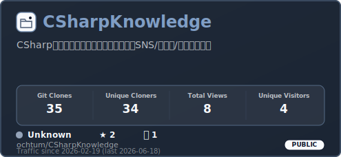
      </a>
    </td>
  </tr>
  <tr>
    <td width="50%" valign="top">
      <a href="https://github.com/ochtum/SVG-Study">
        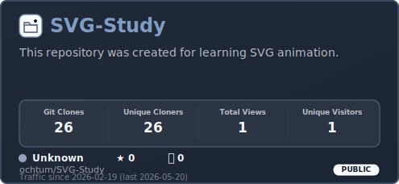
      </a>
    </td>
    <td width="50%" valign="top">
      <a href="https://github.com/ochtum/YamlSettingTest">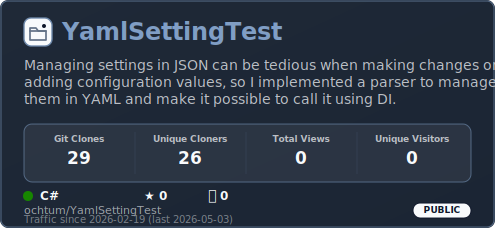
      </a>
    </td>
  </tr>
  <tr>
    <td width="50%" valign="top">
      <a href="https://github.com/ochtum/DaprMultiContainer">
        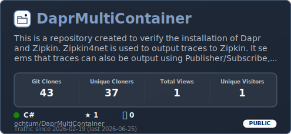</a></td>
    <td width="50%" valign="top"><a href="https://github.com/ochtum/TypeScriptLeaning">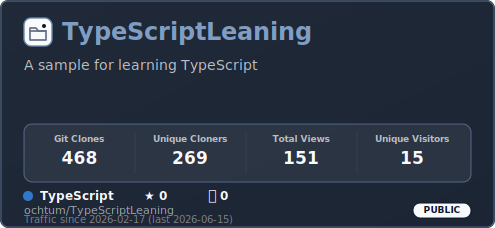</a></td>
  </tr>
  <tr>
    <td width="50%" valign="top"><a href="https://github.com/ochtum/LinkToAllEmployeeList">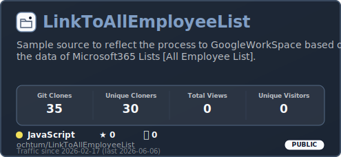</a></td>
    <td width="50%" valign="top"><a href="https://github.com/ochtum/GoogleDriveAddPermission">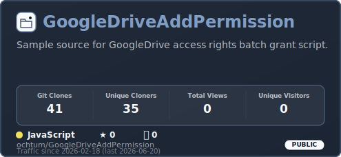</a></td>
  </tr>
</table>

## 🌟 Open Source Contributions

<table>
  <tr>
    <td width="50%" valign="top">
      <a href="https://github.com/Coggle/coggle-translations">
        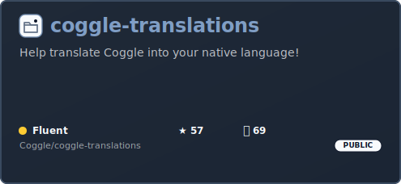
      </a>
    </td>
    <td width="50%" valign="top">
      <a href="https://github.com/linkwarden/linkwarden">
        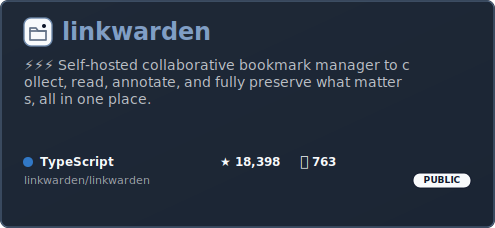
      </a>
    </td>
  </tr>
  <tr>
    <td width="50%" valign="top">
      <a href="https://github.com/microsoft/vscode-generator-code">
        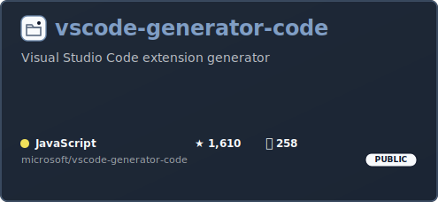
      </a>
    </td>
    <td width="50%" valign="top">
      <a href="https://github.com/tldraw/tldraw">
        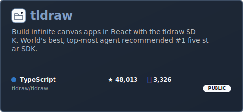
      </a>
    </td>
  </tr>
</table>

## 📱 SNS

- Qiita: [Qiita](https://qiita.com/ochtum)
- LINE: [LINE](https://line.me/ti/p/KaTvFcbhCR)

## 📞 Contact Me

- Discord: [Discord](https://discord.com/users/544655741626351616)
